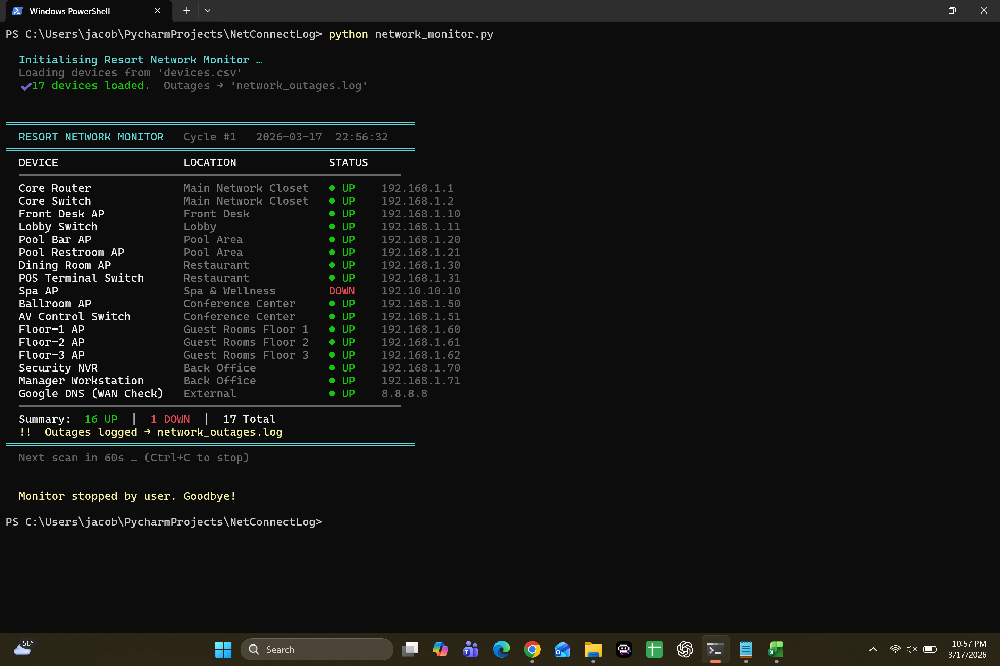
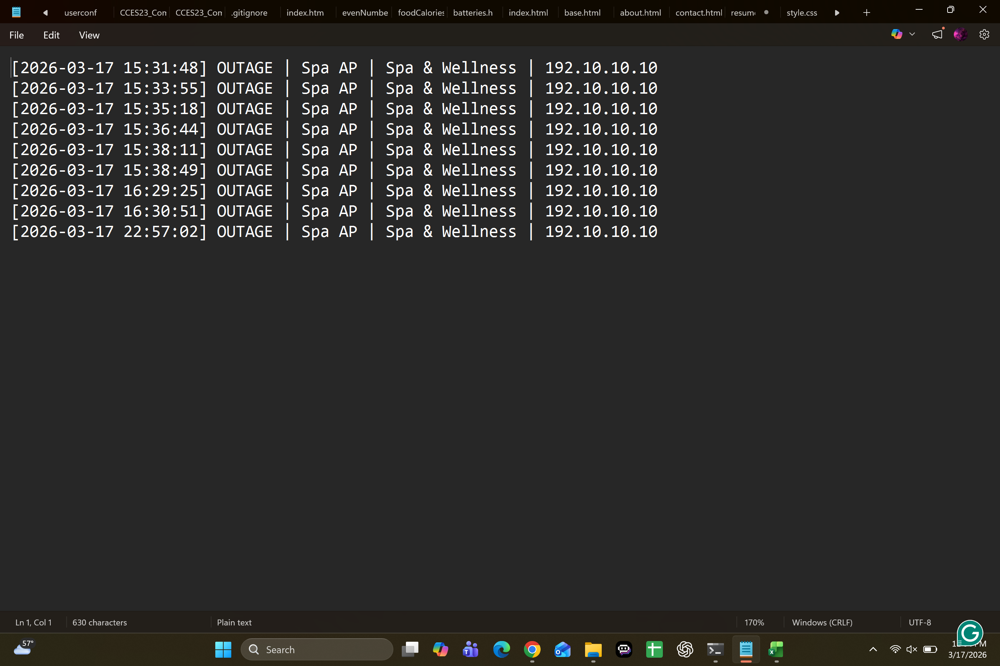

## network_connection_log
Monitors critical network devices, displays live UP/DOWN
status in the terminal, and logs all outages with timestamps.




## Features
- Reads device list from `devices.csv`
- ICMP ping with TCP socket fallback for restricted environments
- Logs outages to `network_outages.log` with timestamps
- Colour-coded terminal output — green UP / red DOWN
- Runs on a configurable loop (default 60 seconds)
- Cross-platform — Windows, macOS, Linux

## Requirements
Python 3.6+. No external libraries — stdlib only.

## Usage
1. Clone the repo
2. Edit `devices.csv` with your network's devices
3. Run:

```bash
python network_monitor.py
```

## CSV format
| IP_Address | Location | Device_Name |
|---|---|---|
| 192.168.1.1 | Main Closet | Core Router |

## Log format
[2026-03-17 14:22:01] OUTAGE | Pool Bar AP | Pool Area | 192.168.1.20
